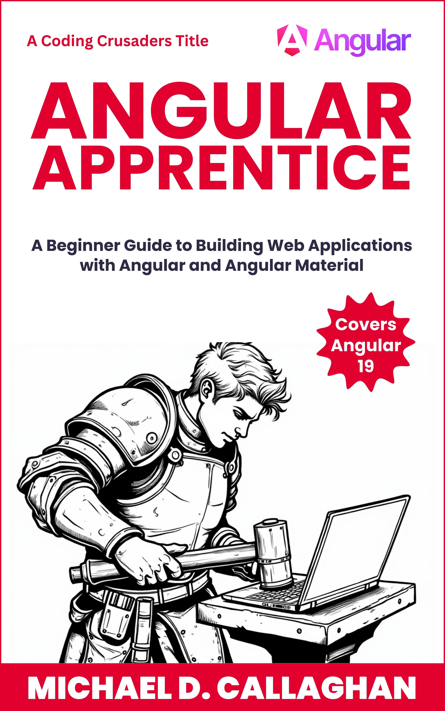

# Angular Apprentice

Building Web Applications - Angular Adventures for Aspiring Developers



## About the Book

Angular Apprentice is a comprehensive guide designed for those new to Angular. This book takes readers on a journey through the fundamentals of Angular, providing step-by-step instructions and practical examples. From setting up the development environment to deploying applications, readers will gain a solid understanding of Angular's core concepts and best practices.

Whether you're a novice developer or looking to enhance your web development skills, this book offers valuable insights and hands-on experience to help you become proficient in building modern web applications with Angular.

## Project Structure

- `/a10dance/` - The main demo application we build throughout the book
- `/chapters/` - Book chapters in Markdown format
- `/front-matter/` - Introductory content
- `/back-matter/` - Concluding content

## Demo Application: A10dance

Throughout this book, we build a real-world application called "A10dance" (a play on "Attendance"). This application demonstrates practical Angular concepts through the development of a student attendance tracking system. Key features include:

- Student roster management
- Attendance tracking
- Parent contact information
- Modern, responsive UI
- State management
- Form handling
- Data persistence

## Prerequisites

To follow along with the examples in this book, you'll need:

- Node.js (Latest LTS version recommended)
- npm (Comes with Node.js)
- Angular CLI
- A code editor (VS Code recommended)
- Basic understanding of HTML, CSS, and JavaScript/TypeScript

## Getting Started

1. Clone this repository
2. Navigate to the demo application:
   ```bash
   cd a10dance
   ```
3. Install dependencies:
   ```bash
   npm install
   ```
4. Start the development server:
   ```bash
   npm start
   ```
5. Open your browser to `http://localhost:4200`

## Chapter Overview

The book is structured to progressively build your Angular knowledge:

1. Introduction to Angular
2. Setting Up Your Development Environment
3. Angular Fundamentals
4. Components and Templates
5. Services and Dependency Injection
6. Forms and User Input
7. HTTP and Backend Integration
8. State Management
9. Testing
10. Deployment

Each chapter includes:
- Theoretical concepts
- Practical examples
- Code snippets
- Exercises
- Best practices

## Contributing

While this is primarily an educational book, we welcome:
- Bug reports for the demo application
- Suggestions for improvements
- Typo corrections
- Additional examples

Please open an issue or submit a pull request.

## License

© 2024 Michael D. Callaghan, All Rights Reserved

## Author

**Michael D. Callaghan** is an experienced software developer and educator with a passion for teaching web development technologies. Through this book, he shares his expertise in Angular, helping new developers build a strong foundation in modern web application development.

---

Happy coding! 🚀
